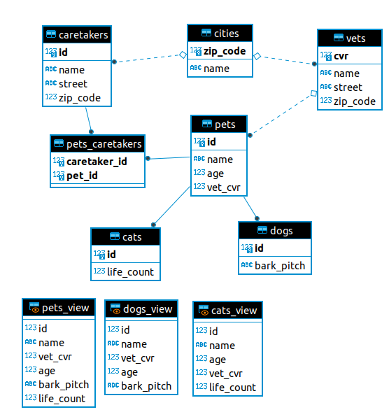

# Assignment #1 - Relational Databases
[Link to assignment](01-relational-db.pdf)  

## Design  

#### Discussion
```diff
- under construction
``` 
- Joint-table strategy
  + Pros:
    - Developmental Dynamic
    - Follows OOP paradigm
  + Cons:
    - Structure gets complicated 
    - Runtime data updates are slow
      + Especially as inheritance tree gets deeper, and e.g. updates has to go through several tables, and obviously having to consider locks and transactions in doing so.
  
- Table-per-class strategy
- Single-table strategy

#### Strategy to implement the inheritance

We went with the joint-tables strategy.

#### ER diagram covering the domain


## Conceptual level implementation

#### Reentrant SQL-script that creates the tables:
- [Tables](https://github.com/BacholarSoftwareDevelopment/DBD/blob/main/Assignment1/Scripts/tables.sql)

####  Reentrant SQL-script with sample data for the tables:
- [Sample data](https://github.com/BacholarSoftwareDevelopment/DBD/blob/main/Assignment1/Scripts/sample_data.sql)

## External level implementation

#### Views and/or stored procedures to deal with the chosen inheritance strategy

We created views for showing all entries for Cats, Dogs an (All) Pets respectively, to hide the table-joints for the user:
- [Views](https://github.com/BacholarSoftwareDevelopment/DBD/blob/main/Assignment1/Scripts/views.sql)

We created stored procedures for inserting and updating cats, dogs and pets respectively. The reason for having a stored procedure for entering each animal, instead of one stored procedure handeling "any pet", is that we find the latter less scalable in case we end up with a database with lots of different animals that inherit from Pet:

- [Stored procedures](https://github.com/BacholarSoftwareDevelopment/DBD/blob/main/Assignment1/Scripts/stored_procedures.sql)


#### Script that creates a designated user for accessing the database:

- [Designated user and acces](https://github.com/BacholarSoftwareDevelopment/DBD/blob/main/Assignment1/Scripts/user_acces.sql)

## Interface implementation

####  A simple program in Java 

Our solution is in the folder [vetdb](https://github.com/PBASOFT/DBD/tree/main/Assignment1/vetdb)
